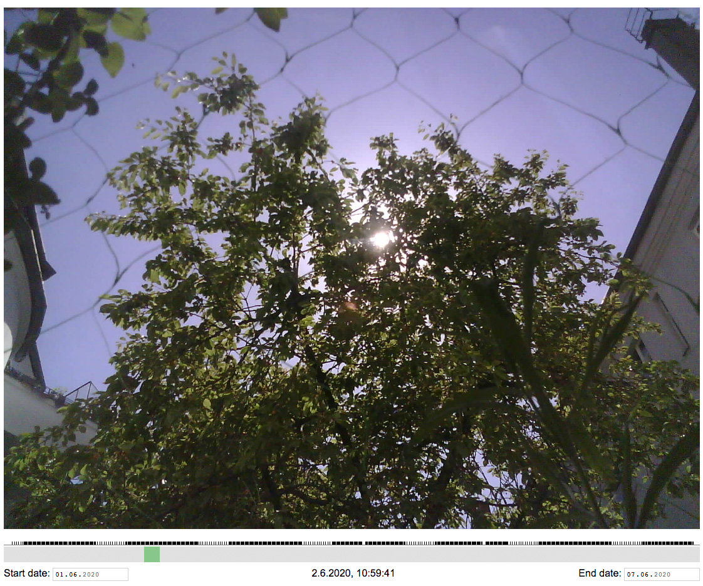

# esp32cam-webcam
 timelapse webcam with sd-storage an upload to server

-   save and upload every 10min a image to sd-card and server.
-   at night the interval decrease to 30min.
-   timeline.php displays all images found in uploaded directory ín a timeline. vertical lines represent available images

Screenshot
